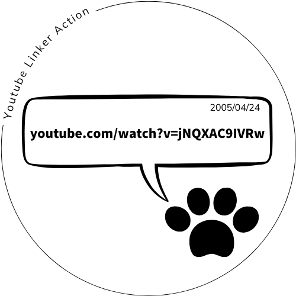

# YouTube Linker Action



[](https://github.com/marketplace/actions/youtube-pr-issue-link-commenter)
[](https://github.com/super-linter/super-linter)
[](https://github.com/actions/typescript-action/actions/workflows/check-dist.yml)
[](https://github.com/actions/typescript-action/actions/workflows/codeql-analysis.yml)
[](./badges/coverage.svg)

## What is this?

This GitHub Action automatically adds a random YouTube video or shorts link as a
comment when a pull request or issue is created.

The comment format like below:

```
[](https://www.youtube.com/watch?v=jNQXAC9IVRw)
<--------------thumbnails-----------------------> | <--------------video link------------------->
```

## Inputs

| Input        | Required | Default | Info                                                 |
| ------------ | -------- | ------- | ---------------------------------------------------- |
| youtube_urls | Yes      | N/A     | List of YouTube URLs (both regular videos and shorts |
| github_token | Yes      | N/A     | GitHub token for creating comments.                  |

## Permissions

This action requires the `pull-requests: write` permission to add comments to pull requests.

## Usage

Basic usage example:

```yaml
name: Add YouTube Comment
on:
  pull_request:
    types: [opened]
  issues:
    types: [opened]

permissions:
  pull-requests: write

jobs:
  comment:
    runs-on: ubuntu-latest
    steps:
      - uses: iisyos/youtube-linker-action@main
        with:
          youtube_urls: |
            https://www.youtube.com/watch?v=hoge
            https://www.youtube.com/shorts/foo
          github_token: ${{ secrets.GITHUB_TOKEN }}
```

## Motivation

Dependabot PRs, while incredibly useful, can feel a bit mechanical and
impersonal. This action aims to add a touch of personality and fun to the
automated update process.

As a fan of Japanese idol music, particularly FRUITS ZIPPER, I was inspired by
their song "NewKawaii" which includes the lyrics `Let's update now` This
perfectly combines the technical nature of dependency updates with a cute,
encouraging message.

Example usage for Dependabot PRs:

```yaml
name: Add YouTube Comment
on:
  pull_request:
    types: [opened]

permissions:
  pull-requests: write

jobs:
  comment:
    runs-on: ubuntu-latest
    if: ${{ github.actor == 'dependabot[bot]' }}
    steps:
      - uses: iisyos/youtube-linker-action@main
        with:
          youtube_urls: |
            https://www.youtube.com/shorts/ThyyFk4tGa0
            https://www.youtube.com/shorts/T6RFDdT4viQ
            https://www.youtube.com/shorts/WUfHauv9cgo
            https://www.youtube.com/shorts/qJMmVLXw1ak
            https://www.youtube.com/shorts/Yc4hWFuiOt4
            https://www.youtube.com/shorts/r7aMeLA4JDg
            https://www.youtube.com/shorts/ifa_BSKB_Kg
          github_token: ${{ secrets.GITHUB_TOKEN }}

```

## License

[MIT](LICENSE)
